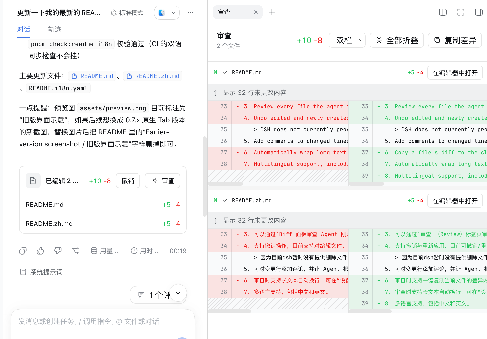

<div align="center">

# DSH File Review

**Review every file an agent just changed—without leaving DeepSeek Harness Web.**

[](package.json)

[](https://www.npmjs.com/package/dsh-file-review)
[](https://www.npmjs.com/package/dsh-file-review)
[](https://github.com/left0ver/dsh-file-review)
[](LICENSE)
[](https://www.dsh.so/artifact/dsh-file-review/)

English · [简体中文](README.zh.md)

</div>

## How to use

<p align="center">
  <strong>💬 Chat &nbsp;→&nbsp; ✨ Generate &nbsp;→&nbsp; 📄 Click a changed file &nbsp;→&nbsp; 🔍 Review</strong>
</p>

## Preview



## Features

1. This plugin supports standard, PTC, and Creator modes, but **does not currently support Minimal mode**.
2. Review every file the agent just changed, shown in the `Diff` panel.
3. Undo edited and newly created files. **Undoing deleted files is not currently supported.**
   > DSH does not currently provide a file-deletion tool, so this plugin cannot yet undo deleted files. Support will be added once DSH provides such a tool.
4. Add comments to changed lines and ask the agent to continue making updates based on the feedback, or ask questions about the changes.
5. Automatically wrap long text while reviewing. Enable it under Settings → Plugins → Plugin configuration → File review; it is disabled by default.
6. Multilingual support — both English and Chinese are supported.

## Compatibility

The badge above shows the DSH CLI version this release was tested against. The plugin also accepts the other prereleases and the final release of that DSH version (for example, every `0.2.0-rc.x` plus `0.2.0`); the exact range is `peerDependencies` in [package.json](package.json).

Outside that range, DSH refuses to load the plugin. To run it anyway at your own risk, grant an exemption for the exact versions involved:

```bash
dsh plugin --profile web allow-version dsh-file-review@<plugin-version> --dsh-version <dsh-version> --accept-risk
```

## Quick start

### 0. Add dsh-file-review to pnpm's minimum release age allowlist

Open `~/.dsh/profiles/web/pnpm-workspace.yaml` and add:

```yaml
minimumReleaseAgeExclude:
  - dsh-file-review
```

Recent versions of `pnpm` enforce a minimum release age, so newly published packages are not installed until that waiting period has passed. To install the latest versions, add `dsh-file-review` to the exclusion list.

### 1. Install this plugin

```sh
dsh plugin --profile web add dsh-file-review
```

### 2. Start DSH Web

```sh
dsh web
```

### 3. Enjoy it

## Install from source

```sh
git clone https://github.com/left0ver/dsh-file-review.git
cd dsh-file-review
pnpm install
pnpm run build
dsh plugin --profile web add ${PWD}
```

## Install from GitHub repository

```sh
dsh plugin --profile web add github:left0ver/dsh-file-review
```

## Update the plugin

```sh
dsh plugin --profile web update dsh-file-review
```

## Uninstall the plugin

```sh
dsh plugin --profile web remove dsh-file-review
```

## Roadmap

- [ ] Add undo support for deleted files.

## Friendly Links

[LINUX DO](https://linux.do/) — A new ideal community

## License

[MIT](LICENSE)
